```{r setup}
#| echo: false
#| eval: true

library(knitr)

# Global options
knitr::opts_chunk$set(echo=TRUE,
        	            cache=FALSE,
                      prompt=FALSE,
                      comment=NA,
                      message=FALSE,
                      warning=FALSE)

# Pour wrap les longs textes exécutés (long print par exemple)
verbwrap <- function(x, options) {
  paste("\\begin{Verbatim}\n",
        x, "\\end{Verbatim}\n", sep = "")
}
knitr::knit_hooks$set(output = verbwrap)

# Pour titre des cartes
library(mapsf)
mf_theme("base", title_cex = 1)
```

# Introduction {.unnumbered}

En sciences humaines et sociales, l'utilisation des cartes mentales et sensibles est fréquente dans les dispositifs méthodologiques des recherches sur les représentations et les pratiques de l'espace. Initiées par des travaux en psychologie [@gould_mental_1974] et en architecture [@lynch_image_1960], les cartes mentales visent à appréhender les « représentations subjectives, à travers un langage graphique (le dessin) d'une réalité spatiale par un individu ou un groupe d'individus » [@toureille_cartes_2016]. Qu'il s'agisse de *sketch maps*, portant sur les représentations spatiales individuelles à partir d'une feuille blanche [@battersby_area_2009; @pinheiro_determinants_1998; @saarinen_advantages_1988], de cartes cognitives [@Montello02092014], relatives à des connaissances spatiales non cartographiées [@dias_relations_2017] ou de cartes interprétatives, analysant les rapports entre espace réel et espace interprété [@didelon_monde_2011], les cartes mentales sont un outil d'enquête riche et foisonnant. Elles permettent d'accéder aux représentations de l'espace tel qu'il est vu, imaginé et construit en fonction du vécu, des expériences et de l'ancrage social d'individus ou de collectifs [@spgeo_0046-2497_1984_num_13_2_3909; @michelhal-01931408].

Toutefois, cet intérêt méthodologique présente des limites importantes en raison de la grande richesse des cartes produites, tant sur le plan de la restitution que dans l'interprétation des résultats. En effet, la collecte d'un grand nombre de cartes, si elle est nécessaire pour renseigner un objet et un espace donné, rend leur appréhension d'ensemble délicate. Leur caractère fortement subjectif demeure difficile à « objectiver », mais essayer de le faire fait courir le risque d’enfermer les représentations produites dans un exercice de cartographie normé, susceptible de ne pas restituer pleinement la subjectivité, la complexité et le flou inhérents aux représentations individuelles et collectives de l’espace, au coeur de l'intérêt même de cette méthode d'enquête [@bunel_modelisation_2021; @quesnot_approches_2024].

C’est à cet enjeu que s’intéresse cet article : comment représenter un corpus de cartes mentales de manière objectivée et synthétique, tout en donnant à voir le flou, la complexité et la subjectivité qui font la richesse d'un tel matériau ?

L’objectif est ainsi de proposer une méthodologie de cartographie synthétique d'un corpus cartes mentales. Pour cela, nous prenons appui sur deux enquêtes récentes, appréhendant des objets, des échelles et problématiques variées, mais qui mobilisent toutes deux des cartes mentales.

- La première est élaborée par Jean @makhlouta_repenser_2025 dans le cadre de sa recherche doctorale sur les mobilités et les stratégies spatiales des minorités sexuelles et de genre à Beyrouth. Parmi d'autres outils méthodologiques qualitatifs, il y interroge au moyen de 84 cartes mentales, les représentations et les pratiques plurielles de la ville et de ses quartiers. L'objectif est d'accéder à une géographie émotionnelle de Beyrouth afin de mieux comprendre le rapport à l'espace urbain de ces minorités, encore peu enquêtées, et d'envisager la ville selon leurs perceptions négatives et positives des lieux.

- La seconde enquête mobilisée est réalisée au sein de l'ANR-DFG Imageun (« *In the Mirror of the European Neighbourhood (Policy) : Mapping Macro-Regional Imaginations* ») et de la recherche doctorale de Camille @dabestani_refaire_2025 sur les représentations et les appropriations étudiantes des imaginaires macrorégionaux en contexte postcolonial, et plus spécifiquement en Martinique et en Guadeloupe. Cette enquête numérique a permis la collecte de plus de 2000 cartes mentales numériques sur des découpages du monde imaginés par des étudiants répartis dans 5 pays (Allemagne, France, Irlande, Tunisie et Turquie).

À partir de ces deux enquêtes, nous proposons de présenter et d'analyser l'usage des cartes mentales et des représentations cartographiques synthétiques dans des dispositifs qualitatifs et quantitatifs. Il s'agit d'abord de présenter les protocoles de collecte des cartes mentales, puis leurs traitements respectifs sous R en vue de leurs agrégations et de leurs représentations sous forme de cartes de chaleur. Enfin, nous discuterons des articulations entre les corpus, des éléments d'interprétation émergeant ainsi que des limites et des perspectives à cette recherche.

Tout au long de cet article, nous articulerons les méthodes mobilisées dans le cadre des deux enquêtes. Elles permettent de montrer les manières dont cette démarche de cartographie peut être utilisée pour des cartes mentales aux formats papier et numérique, de l'échelle infra-urbaine au niveau macrorégional, pour des grands échantillons comme pour des ensembles et sous-ensembles plus fins, mais aussi en articulation avec des démarches qualitatives et mixtes.

À travers ces deux exemples, l’objectif est pour nous d’expliciter, de permettre la reproduction et l’adaptation de cette démarche aux personnes travaillant à partir de cartes mentales dans le cadre de leurs projets. Nous présentons ainsi pas à pas les démarches des deux enquêtes afin de faciliter la réappropriation de cette méthode cartographique.

# Choix cartographiques préalables et outils mobilisés

## Les cartes de chaleur comme outil de cartographie synthétique

Dans le cadre des deux recherches mobilisées ici, nous avons choisi une cartographie synthétique à partir d'un modèle connu sous le nom de "cartes de chaleur" (carte thermique, carte de fréquentation, ou *heatmap*). Il s'agit d'une représentation graphique de données statistiques qui permet de décrire l'intensité d'une variable par un dégradé de couleur, dans un espace à deux dimensions (matrice).

](figures/heatmap.png){#fig-1 fig-align="center" width=70% target="_blank"}

Cette méthode de représentation en deux dimensions (@fig-1) peut être appliquée à une image (matrice de pixels) géoréférencée dans l'espace (image matricielle ou *raster*[^raster]). Elle est souvent utilisée pour représenter des données géographiques issues de la télédétection[^teledec], comme les températures (@fig-2), les précipitations ou l'altitude. 

[^raster]: Le modèle de données *raster* (en français : image matricielle) se compose d'une matrice de pixels arrangés en lignes et colonnes pour ainsi former une grille et représenter, avec une relative précision, un ensemble d'informations. Les rasters peuvent avoir plusieurs origines, photographies aériennes numériques ou encore images satellites et numériques. (source : Esri France, 2025)

[^teledec]: La télédétection regroupe toutes les opérations systématiques et automatisées de traitement et d'interprétation des photographies aériennes et des images satellites. Contrairement à la photo-interprétation qui est réalisée par des humains, elle met en œuvre des procédés technologiques, autrefois analogiques et aujourd'hui numériques, pour transformer l'image en données géolocalisées, notamment en couches exploitables dans les systèmes d'information géographique. (source : Géoconfluences, 2025)

[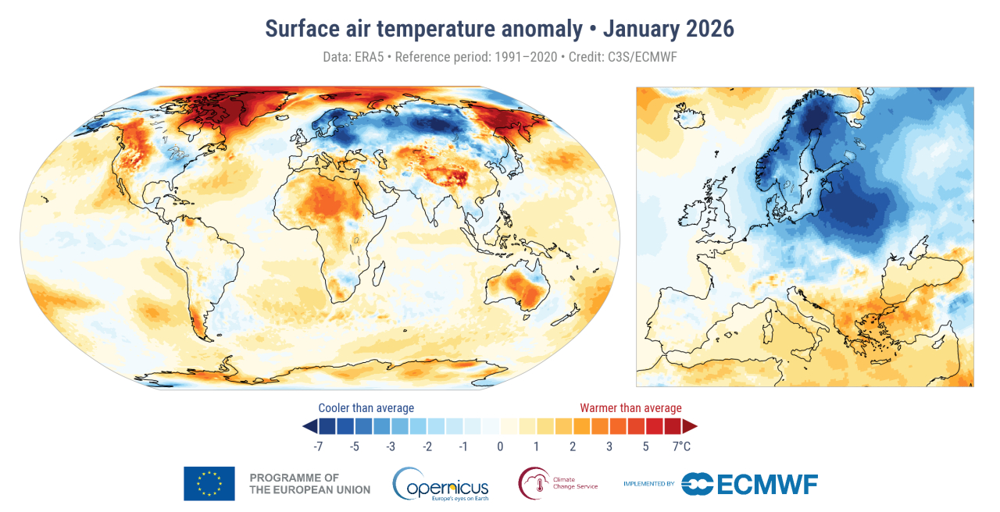{#fig-2 fig-align="center" width=70%}](https://climate.copernicus.eu/surface-air-temperature-january-2026){target="_blank"}

Dans ce cas, les deux dimensions de la matrice (longitude et latitude) permettent de localiser un phénomène dont l'intensité est décrite par l'usage d'une variable visuelle de couleur et/ou de valeur en dégradé ou camaïeu [@Bertin1967]. Cette méthode permet alors d'identifier facilement les zones de forte ou faible intensité et d’interpréter l'organisation spatiale du phénomène étudié.

Nous avons ainsi utilisé cette méthode de représentation cartographique afin d'analyser les deux ensembles de cartes mentales de manière agrégée, en vue d'une interprétation synthétique et quantifiée de tracés aux formats papier (enquête de Jean Makhlouta) et numérique (enquête de l'ANR-DFG Imageun et de Camille Dabestani) collectés. Nous avons décomposé la construction de cartes de chaleur à partir de ces deux corpus de cartes mentales (@fig-img_methode) :

1. Création d'une grille régulière, comme maillage de référence (cf. @sec-creation_dune_grille ).
2. Cumul (comptage) des polygones dessinés dans la grille régulière (cf. @sec-aggregation_des_cartes). 
3. Simplification de la représentation graphique matricielle en isolignes (cf. @sec-carte_synthetique).

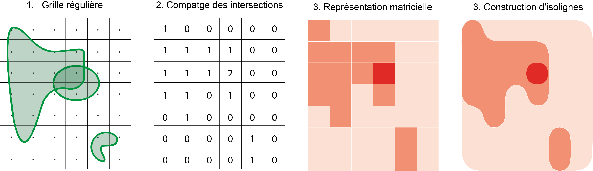{#fig-img_methode fig-align='center' width=80%}

## Packages R utilisés 

L'ensemble de la chaîne de traitements est conçue pour le langage R. Les packages suivants sont indispensables pour la réaliser :

-   `sf` pour la manipulation de données géographiques vectorielles [@sf]
-   `geodata` pour télécharger des fonds de carte [@geodata2025]
-   `mapsf` pour la construction de cartes thématiques [@mapsf]
-   `mapiso` pour la création d'isobandes [@mapiso]

```{r packages}
#| echo: true
#| eval: true

library(sf)      # Manipulation données géographiques
library(geodata) # Téléchargement d'un fond de carte "monde"
library(mapsf)   # Cartographie
library(mapiso)  # Création d'isobandes

```

# Présentation des deux corpus de cartes mentales

Pour cette démonstration, l'intégralité des données nécessaires à la reproductibilité de la chaîne de traitement est mise à disposition. Les deux jeux de données de cartes mentales issues des enquêtes utilisées dans l'article sont téléchargeables en cliquant sur l'icône ci-dessous. Pour assurer leur partage et leur réutilisation, ils ont été anonymisés.

[{width=28%}](data.zip)

Avant de détailler les étapes de cartographie synthétique, nous présentons ici brièvement les deux corpus de cartes mentales, les fonds de cartes et les démarches d'enquête mobilisées.

Nous nommerons le corpus des cartes mentales sur les représentations des quartiers de Beyrouth "Corpus A", et le corpus sur les représentations des régions du monde "Corpus B". Pour chaque encadré, deux onglets permettent de visualiser les cartes et les visuels des deux corpus.

## Les corpus de cartes mentales

Si les deux enquêtes mobilisent toutes deux des cartes mentales au sein de dispositifs pluri-méthodologiques et pour appréhender des pratiques et des représentations de l'espace ascendantes, elles n'en restent pas moins très différentes autant dans les supports, que dans le processus de collecte.

Le Corpus A portant sur Beyrouth est composé de cartes mentales collectées lors d'entretiens individuels. Les personnes enquêtées sont invitées à délimiter et à représenter les perceptions positives et négatives qu'elles ont des différents quartiers de la ville. Les enquêté.es réalisent ces tracés sur un fond de carte papier, où les quartiers sont indiqués, en interaction avec l'enquêteur.

Le Corpus B est lui, constitué de cartes mentales numériques intégrées au sein d'un questionnaire en ligne. Auto-administré et sans supervision, le questionnaire se déroule via une application en ligne (Maptionnaire). L'exercice de carte mentale, au milieu du questionnaire, propose aux étudiant.es enquêté.es de représenter les régions du monde dans lesquelles ils et elles résident sur un fond de carte interactif, où ils et elles peuvent naviguer. Dans le cadre de la thèse de Camille Dabestani (cas de la Guadeloupe et de la Martinique), l'entretien avec les répondant.es a lieu a posteriori du questionnaire.


|   | 1\. Corpus de cartes mentales "locales" | 2\. Corpus de cartes mentales "globales" |
|:---------------:|:-------------------------------:|:----------------------------------:|
| **Type d'enquête** | **Entretien**, collecte **supervisée** | Enquête **non-supervisée** |
| **Questionnement par carte mentale ?** | **Délimitations** et représentations positives et négatives de **quartier** | Délimitation de sa **région** d'appartenance |
| **Outil de collecte** | Saisie sur **papier** - Cartographie sur un fond de carte avec uniquement la délimitation de quartiers | Saisie **numérique** - Cartographie sur fond de carte interactif (OpenStreetMap) |
| **Echelle de saisie** | Intra-urbaine | Macrorégional |
| **Nombre d'enquêtés** | 80 | 2030 |
| **Nombre de surfaces dessinées (polygones collectés)** | 402 | 2744 |


Ces deux processus de collecte ont des objectifs différents et s'inscrivent dans des contextes hétérogènes qui produisent des volumes de données et une hétérogénéité de représentations importantes en leur sein, et notamment dans le Corpus B, auto-administré et dans cinq contextes nationaux. En prenant appui sur la pluralité représentées par ces deux corpus de cartes mentales, il s'agit pour nous de montrer que la méthode de représentation cartographique synthétique par carte de chaleur peut être mobilisée dans des cadres et pour des données variées.

::: {.callout-note title="Du dessin à l'information géographique"}
Pour réaliser la chaîne de traitements présentée, il est indispensable que les "dessins" collectés soient géoréférencés[^georef] et digitalisés. Cela revient à positionner correctement les cartes mentales dans l'espace en leur assignant des coordonnées géographiques précises, puis à les numériser pour les transformer en données géographiques vectorielles (lignes ou polygones), manipulables et exploitables.

[^georef]: Le géoréférencement est un processus permettant d'attribuer à une image numérique à dimension spatiale (image satellite, plan, etc.) des coordonnées géographiques, en lui appliquant une transformation.

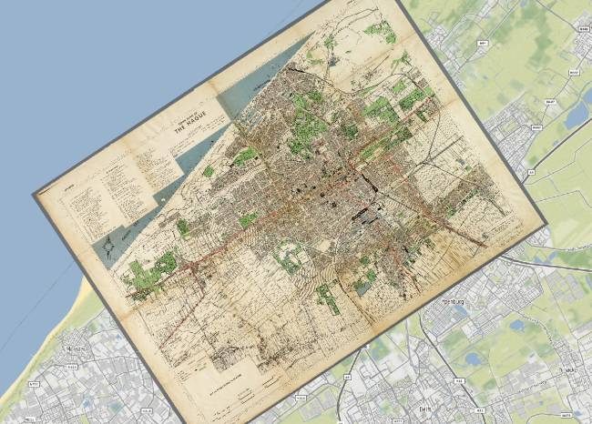{#fig-ex_digitalisation width=70% fig-align='center'}

Ainsi, les cartes mentales, représentant des surfaces ou des contours de territoires, sont converties en information géographique manipulable et cartographiable. Ce travail de géoréférencement et de digitalisation (@fig-ex_digitalisation) a par exemple été réalisé pour le premier corpus de cartes mentales utilisé dans cet article (cf. @sec-corpus_A_intra_urbaine).

:::


## Fonds de cartes utilisés

Pour la mise en page des cartes de chaleur, nous utiliserons deux fonds de carte différents : le premier représentant les quartiers de Beyrouth (A), le second les pays du monde (B).

::: panel-tabset
##### A. Quartiers de Beyrouth

```{r basemap_1}
#| echo: true
#| eval: true
#| fig-align: center

# Import des données
beyrouth <- st_read(dsn ="data/beyrouth.gpkg", layer="quartier", quiet = TRUE)

# Affichage
mf_map(beyrouth)
```

Source : Farah, 2011 ; Beirut Urban Lab, 2021 ; Makhlouta, 2025 et Marveaux, 2026

##### B. Pays du Monde

```{r basemap_2}
#| echo: true
#| eval: true
#| fig-align: center


# Téléchargement du fond de carte
world <- st_as_sf(world(resolution=5, level=0, path="data/world"))

# Affichage
mf_map(world)

# Reprojection en Pseudo-Mercator
world <- st_transform(world, crs = "EPSG:3857")
```

Source : [https://gadm.org](https://gadm.org){target="_blank"}, via le package `geodata` (@geodata2025)

:::


## Description des méthodes d'enquête et des corpus de cartes mentales 

Afin d'appréhender plus facilement les traitements opérés sur les cartes mentales, nous proposons de regarder succinctement la composition des deux jeux de données et leurs processus de collecte.

### Des cartes mentales pour appréhender les représentations intra-urbaines de Beyrouth (Corpus A) {#sec-corpus_A_intra_urbaine}

Pour la première enquête menée à l'échelle de Beyrouth, le corpus de cartes mentales se compose de 84 cartes recueillies sur place entre 2022 et 2023. Celles-ci sont réalisées sur un fond de carte de Beyrouth indiquant les noms des quartiers retenus pour l'enquête ainsi que leurs limites administratives. Ce fond de carte inclut l'ensemble des quartiers de la municipalité de Beyrouth, autrement dit *intra-muros*, ainsi que des quartiers situés dans les banlieues est et sud de la ville.

Les participant·es sont invité·es à réaliser une carte mentale au début d'un entretien semi-directif qui constituait le socle de la recherche. L'entretien s'ouvre sur la consigne suivante : « Entourez les quartiers où l'expression de votre genre ou de votre sexualité est possible. Entourez, avec une autre couleur, ceux où c'est interdit ». Des crayons de couleur sont mis à disposition pour l'exercice et le choix des couleurs est entièrement laissé aux participant·es. Les tracés ainsi dessinés donnent à voir une délimitation de la ville fondée sur leurs ressentis et leurs expériences spatiales.

Voici quelques exemples de cartes mentales collectées :

:::: {.content-visible when-format="html"}
::: panel-tabset
###### Carte n°1 {.unnumbered}
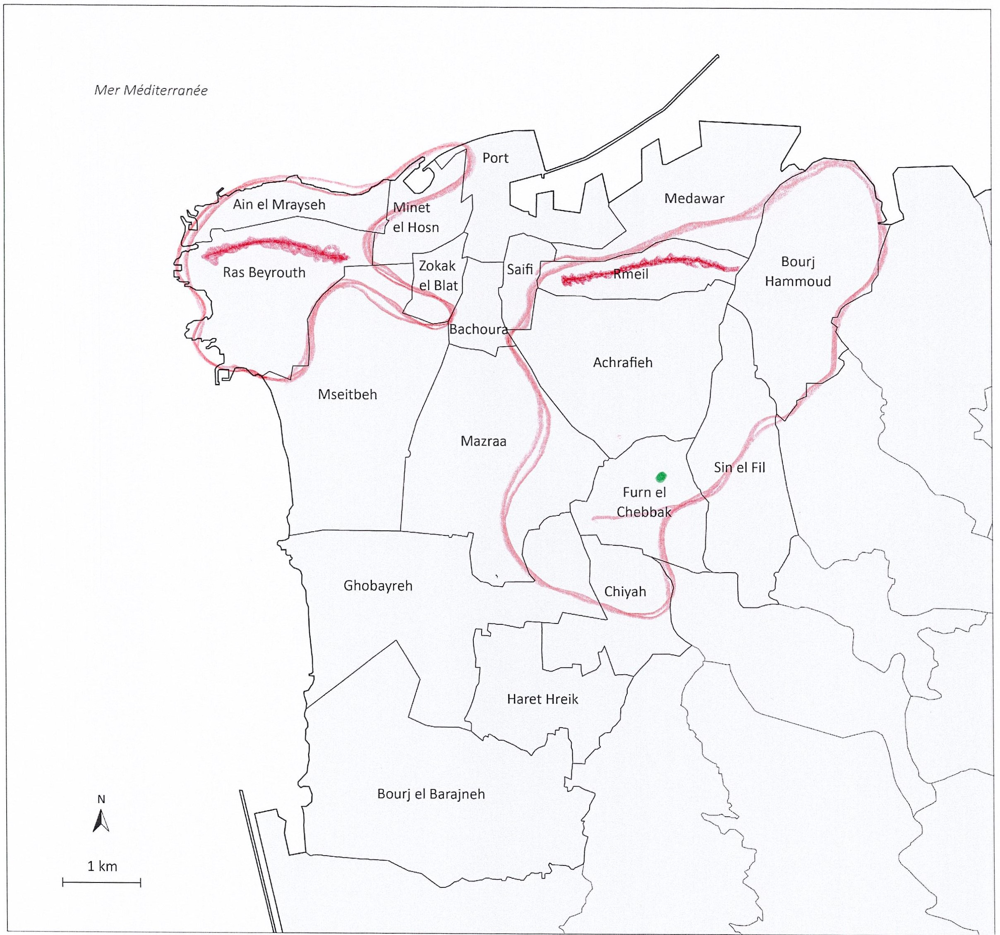

###### Carte n°14 {.unnumbered}
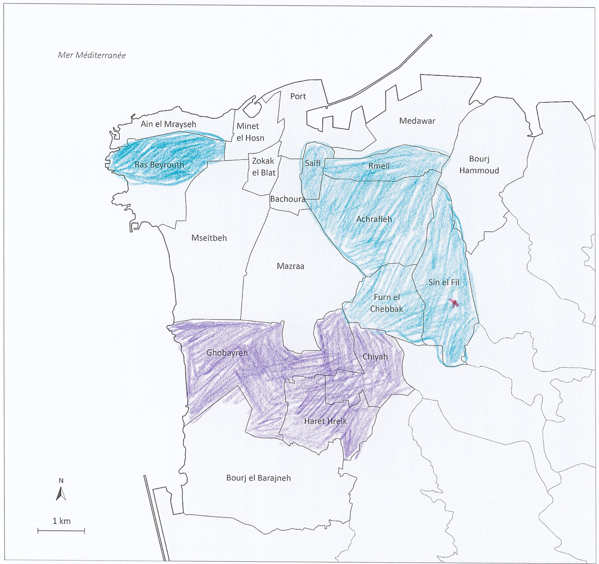

###### Carte n°24 {.unnumbered}
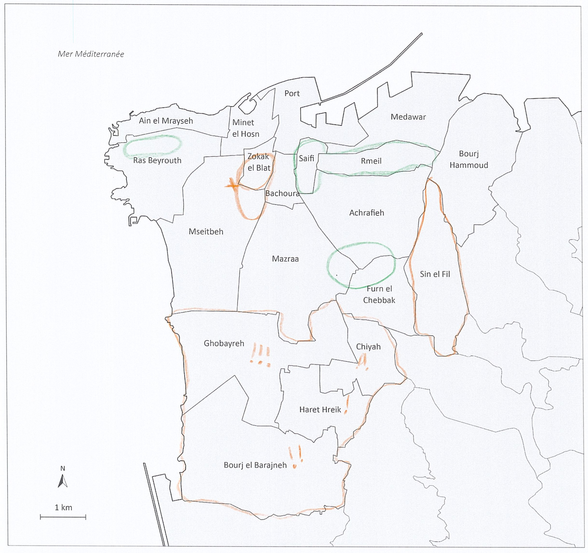

###### Carte n°34 {.unnumbered}
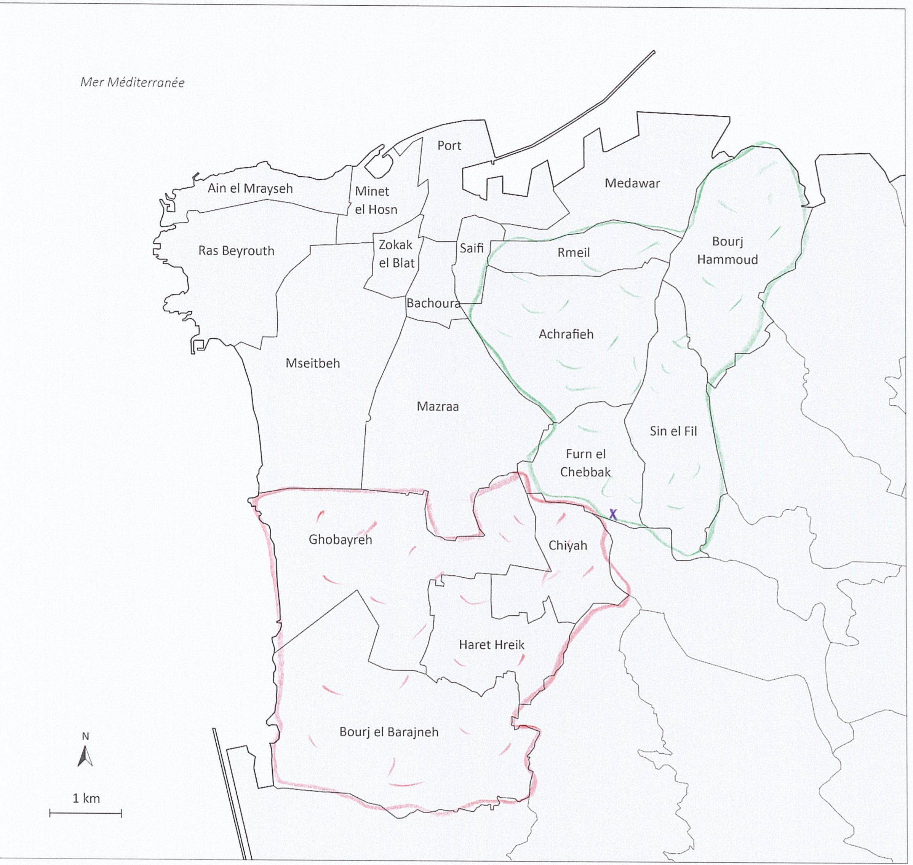

###### Carte n°56 {.unnumbered}
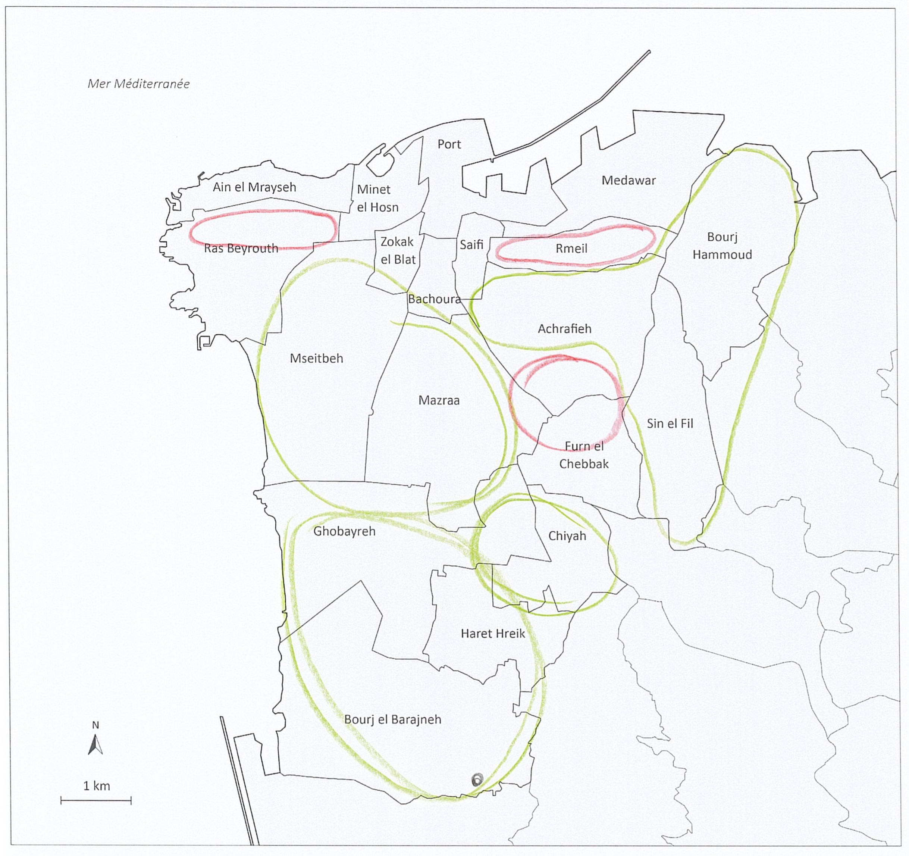

:::
::::


:::: {.content-visible when-format="pdf"}
::: {layout-ncol=2}


:::
::::

Les cartes sont scannées puis géoréférencées sous QGIS (@fig-ex_digitalisation) et les tracés des participant·es vectorisés sous forme de polygones auxquels sont associés plusieurs attributs, dont, la qualification positive ou négative des espaces entourés. Le tableau et les cartes ci-dessous présentent la synthèse de ces informations sous QGIS.

Ces données spatiales sont mises à disposition dans un fichier *geopackage* qui peut être importé avec la fonction `st_read()` du package `sf`.

```{r data_Makhlouta}
#| echo: true
#| eval: true

mentals_maps_beyrouth <- st_read(dsn ="data/Couche Polygones.gpkg", quiet = TRUE)

```
\

La table attributaire des délimitations dessinées comporte plusieurs variables :

```{r data_Makhlouta_table}
#| echo: false
#| warning: false
#| eval: !expr knitr::is_html_output()

# POUR SORTIE HTML
library(DT)
datatable(
    mentals_maps_beyrouth, 
    rownames = FALSE,  
    extensions = 'Buttons', options = list(
    dom = 'Bfrtip', pageLength = 5))
```

::: {.content-visible when-format="pdf"}


| Numéro.carte.mentale | Numéro.entretien | Pseudonyme | Genre...sexualité.minoritaire       | Perception.du.genre.dans.l.espace.public | Âge | Nationalité | Classe.sociale | Confession       | Quartier.de.résidence | Situation.au.domicile | Date.de.réalisation | Indicateur | geometry        |
|---------------------:|-----------------:|------------|-------------------------------------|------------------------------------------|----:|-------------|----------------|------------------|-----------------------|-----------------------|---------------------|------------|-----------------|
|                    1 |                9 | Bilal      | Gay                                 | Homme                                    |  28 | Libanaise   | Classe moyenne | Musulmane chiite | Furn el Chebbak       | Colocation            | 2022-03-30          | Positif    | [object Object] |
|                    1 |                9 | Bilal      | Gay                                 | Homme                                    |  28 | Libanaise   | Classe moyenne | Musulmane chiite | Furn el Chebbak       | Colocation            | 2022-03-30          | Positif    | [object Object] |
|                    2 |               10 | Amar       | Non-cisgenre et non hérérosexuel-le | Femme                                    |  28 | Libanaise   | Classe moyenne | Musulmane chiite | Mazraa                | Avec partenaire       | 2022-03-31          | Négatif    | [object Object] |
|                    2 |               10 | Amar       | Non-cisgenre et non hérérosexuel-le | Femme                                    |  28 | Libanaise   | Classe moyenne | Musulmane chiite | Mazraa                | Avec partenaire       | 2022-03-31          | Négatif    | [object Object] |
|                    2 |               10 | Amar       | Non-cisgenre et non hérérosexuel-le | Femme                                    |  28 | Libanaise   | Classe moyenne | Musulmane chiite | Mazraa                | Avec partenaire       | 2022-03-31          | Positif    | [object Object] |
:Extrait de la table attributaire corpus Beyrouth

:::


::: {.callout-note title="A propos des projections"}
Pour mener à bien la démonstration, les fonds de cartes doivent avoir la même projection (ou système de coordonnées de référence) que les données. La projection peut être connue avec la fonction `st_crs` de `sf` et être appliquée aux fonds de cartes *a posteriori* si besoin  :

```{r}
#| echo: true

st_crs(beyrouth)$srid
st_crs(mentals_maps_beyrouth)$srid

beyrouth <- st_transform(beyrouth, crs = st_crs(mentals_maps_beyrouth))
```

:::

Après digitalisation des délimitations réalisées individuellement sur chaque carte mentale, il est ainsi possible de visualiser l'ensemble des délimitations collectées :

:::: {.content-visible when-format="html"}
::: {.panel-tabset}

##### Exemple de délimitation digitalisée

```{r data_Makhlouta_ex}
#| echo: false
#| fig-align: center

beyrouth <- st_read(dsn ="data/beyrouth.gpkg", layer="quartier", quiet = TRUE)

map_mental_brth_1 <- function(){
  mf_init(mentals_maps_beyrouth[1,], )
  mf_map(x = beyrouth, 
     col = "#cccccc", 
     border = "white", 
       add = TRUE)
  
  mf_map(x = mentals_maps_beyrouth[1,],
       col = "#85c1d350", 
       border = "#85c1d3",
       lwd = 2,
       add = TRUE)

# Titre avec l'id du répondant et l'id de la géométrie
title(paste0(mentals_maps_beyrouth[1,]$Pseudonyme, " - Ressenti du quartier : ", mentals_maps_beyrouth[1,]$Indicateur),  adj = 0, cex = .5)
}

map_mental_brth_1()
```

##### Ensemble des délimitations collectées

```{r data_Makhlouta_corpus}
#| echo: false
#| cache: true
#| fig-align: center

map_mental_brth_all <- function(){
  mf_init(mentals_maps_beyrouth)
mf_map(x = beyrouth, 
     col = "#cccccc", 
     border = "white", 
       add = TRUE)

mf_map(x = mentals_maps_beyrouth,
       col = NA, 
       border = "#85c1d3",
       lwd = 1,
       add = TRUE)

# Titre avec l'id du répondant et l'id de la géométrie
title('Délimitations collectées dans le corpus "Beyrouth"',  adj = 0, cex = .5)
}

map_mental_brth_all()
```

:::
::::

:::: {.content-visible when-format="pdf"}
::: {layout-ncol=2}

```{r}
#| echo: false
map_mental_brth_1()
```

```{r}
#| echo: false
map_mental_brth_all()
```

:::
::::

### Des cartes mentales pour appréhender les imaginaires portés sur les régions du monde (Corpus B){#sec-corpus_B_regionales} 

La seconde enquête par carte mentale que nous mobilisons dans cet article est celle créée dans le cadre du volet « *Student Survey* » de l'ANR-DFG Imageun [@IMAGEUN_DEMC2025]. En prenant appui sur de précédentes recherches comme le projet EuroBroadMap [@beauguitte_projet_2012], Espon [@didelon_vision_2010] ou encore la thèse de doctorat d'Etienne Toureille [-@toureille_turquie_2017], l'objectif de ce projet est d'analyser ce qu'on appelle les imaginaires macrorégionaux des étudiant·es, soit les pratiques, les représentations et les discours portés sur des ensembles géographiques entre l'échelle de l'État et l'échelle mondiale. Ces imaginaires sont appréhendés comme des objets construits de manière descendante par les institutions, les décideurs politiques ou encore par les médias, mais aussi vécus, questionnés et réappropriés de manière ascendante par les individus et les collectifs, ici les étudiant·es.

Le volet « *Student Survey* » du projet a deux objectifs. Le premier est d'analyser les manières dont les étudiant·es pratiquent et représentent les macrorégions qui leur sont associées ou qu'ils et elles revendiquent : comment les étudiant·es mobilisent-ils, refusent-ils ou repensent-ils les imaginaires géographiques qu'on leur associe ?

Dans la mesure où l'enquête devait être réalisée dans le contexte pandémique du Covid-19, le cahier des charges a nécessité des ajustements quant à la mise en place du dispositif d'enquête. Ainsi, cette enquête avait aussi pour but d'interroger les manières d'appréhender et d'objectiver des objets géographiques flous et subjectifs à l'aide d'un questionnaire portant un exercice de carte mentale numérique.

L'enquête prend donc la forme d'un questionnaire cartographique en ligne. Il se divise en sept parties visant à appréhender les imaginaires macrorégionaux dans une approche socio-constructiviste : des questions de cadrage socio-démographique sur l'étudiant·e, les pratiques linguistiques, les mobilités réalisées et souhaitées, la représentation cartographique de leurs macrorégions (carte mentale), les pratiques médiatiques, les pratiques culturelles, les représentations de l'Europe et de l'UE et les questions de cadrage socio-démographique sur les parents et tuteurs des étudiant·es[^demc].

[^demc]: Pour la présentation détaillée de l'enquête, voir l'article publié dans la revue DEMC : [https://demc-journal.org/articles/revue-3/4077-studying-geographical-imaginaries-with-numeric-mental-maps](https://demc-journal.org/articles/revue-3/4077-studying-geographical-imaginaries-with-numeric-mental-maps){target="_blank"}.

La diffusion du questionnaire, non supervisée, a eu lieu entre novembre 2021 et juin 2022. Les étudiant·es peuvent répondre sur PC, tablette ou sur smartphone et sélectionner au départ la langue de visualisation et de réponse parmi les cinq langues de traduction du questionnaire : allemand, anglais, darija[^darija], français, turc. Le questionnaire est auto-administré et dure entre 10 à 25 minutes dans le cas où l'enquêté·e répond à toutes les questions, malgré les questions de tri visant à réduire la durée du questionnaire[^questImageun]  en fonction des informations renseignées au fil de la participation.

[^darija]: Langues vernaculaires dérivées de l'arabe, parlées en Tunisie, au Maroc et en Algérie.

[^questImageun]: Plus de précisions sur le mode de collecte, les établissements enquêtés, la composition des sous-groupes et les enjeux et limites qu'elle pose, sont apportées par le datapaper publié dans la revue DEMC.

La collecte a été effectuée avec l'outil d'enquête Maptionnaire. Cette application de SIG participatif a été créée par une équipe de chercheuses et de professionnelles de l'aménagement pour répondre à des besoins de cartographie collaborative, avec le soutien de l'institut de recherche Nordregio[^nordregio] [@geertman_softgis_2009]. Elle permet ainsi de présenter des questions standards du format de questionnaire (choix uniques, choix multiples, ouverts, etc.) et des questions cartographiques, permettant de placer des points, de tracer des lignes ou de polygones « comme avec un crayon » sur un fond de carte adaptatif OpenStreetMap dans lequel les étudiant·es peuvent circuler comme sur une interface de navigation GPS quotidienne. L'avantage de cette interface adaptative – où les frontières, les limites administratives et les toponymes s'affichent – était de fournir un fond de carte ne mettant pas les étudiant·es dans la posture de réponse à un test de connaissances.

[^nordregio]: *Nordic research institute for regional development and planning*

La question de carte mentale a un statut central dans cette enquête. Elle permet d'inviter les étudiant·es à tracer les régions du monde dans lesquelles ils et elles se trouvent au moment de l'enquête (un à cinq espaces). Après chaque tracé, une fenêtre pop-up permet de nommer l'espace représenté.

Les données sont collectées sous la forme de deux fichiers : le premier (*survey.csv*) contient les réponses aux questions dites « standards » codées de différentes manières (brut, booléens, etc.), et le second, au format *geopackage*, intègre les géométries des cartes mentales tracés (*geometries.gpkg*).

Ces géométries ont fait l’objet de plusieurs étapes de traitement : nettoyage, construction et réparation. Ces opérations, ainsi que les procédures de pseudonymisation, sont décrites en détail dans un article [@IMAGEUN_DEMC2025] accompagné d’un site de présentation et de prise en main [@marveaux_etudier_2024] de la base de données mise à disposition [@marveaux_imageun_2024]. L’ensemble de ces traitements a permis d’obtenir 2 744 géométries, produites par 2 030 répondant·es, couvrant l’ensemble des pays de l’enquête.

Pour importer la couche géographique contenant les cartes mentales, nous utilisons le package `sf` et sa fonction `st_read()`.

```{r data_imageun_1}
#| echo: true
#| eval: true

mentals_maps_macro_reg <- st_read(dsn = "data/geometries.gpkg", 
                                  layer = "mental_maps", quiet = TRUE)

```

La table attributaire des délimitations dessinées comporte plusieurs variables associées aux tracés (nom associé par l'étudiant.e à l'espace représenté, identifiants, recodages et traductions). Les données socio-démographiques et le reste des réponses du questionnaires sont disponibles dans une seconde base de données, qui peut être jointe aux tracés :

```{r data_imageun_2}
#| echo: false
#| warning: false
#| eval: !expr knitr::is_html_output()
#| cache: false

# POUR SORTIE HTML
library(DT)
datatable(
    mentals_maps_macro_reg[, c(2,3,8,12)], 
    rownames = FALSE,  
    extensions = 'Buttons', options = list(
    dom = 'Bfrtip', pageLength = 5))
```

::: {.content-visible when-format="pdf"}


| X0001_met_respID_aut | Index | E1903_map_rgname | E1903_map_rgname_concept_fr | geom            |
|----------------------|------:|------------------|-----------------------------|-----------------|
| 22ar4abw96i7         |     1 |                  |                             | [object Object] |
| 22fom832dsi6         |     1 | Europe           | Europe                      | [object Object] |
| 22ir9ngt4ft3         |     1 | Europe           | Europe                      | [object Object] |
| 22ix4ge73ema         |     1 | Antilles         | Antilles                    | [object Object] |
| 22nri3iyx7w4         |     1 | Franken          | Franconie                   | [object Object] |
:Extrait de la table attributaire corpus IMAGEUN

:::
\
Pour cet article, nous ne mobiliserons qu'une partie des cartes mentales de la base de données IMAGEUN, à savoir les macro-régions dessinées nommées 'Caraïbes' par les étudiant·es. Nous commençons donc par sélectionner les géométries concernées :

```{r data_imageun_3}
#| echo: true
#| warning: false
#| cache: false

mentals_maps_macro <- subset(mentals_maps_macro_reg, 
                             E1903_map_rgname_concept_fr %in% c("Caraïbes"))


```

:::: {.content-visible when-format="html"}
::: panel-tabset
##### Exemple de région délimitée

```{r basemap_0}
#| echo: false
#| eval: true
#| fig-align: center

# Téléchargement du fond de carte
world <- st_as_sf(world(resolution=5, level=0, path="data/world"))

# Reprojection en WGS 84 / Pseudo-Mercator
world <- st_transform(world, crs = "EPSG:3857")
```

```{r data_imageun_4}
#| echo: false
#| cache: true
#| fig-align: center

map_data_imageun_4 <- function(){
mf_init(mentals_maps_macro [9,])

mf_map(world, 
     col = "#cccccc", 
     border = "white", 
       add = TRUE)

mf_map(mentals_maps_macro [9,],
     col = "#85c1d350", 
     border = "#85c1d3",
     lwd = 2,
     add = TRUE)

# Titre avec l'id du répondant et l'id de la géométrie
title(paste0("Répondant N° ",mentals_maps_macro [9,]$X0001_met_respID_aut, " - Carte N° ", mentals_maps_macro [9,]$ID_geom),  adj = 0)


# Mot associé à la géométrie
mtext(text = paste0("Mot associé à la région déssinée : '",mentals_maps_macro[9,]$E1903_map_rgname,"'"), 
      side = 3, adj = 1, line = -1)
}

map_data_imageun_4()
```

##### Ensemble des régions nommées 'Caraïbes'

```{r data_imageun_5}
#| echo: false
#| cache: true
#| fig-align: center

map_data_imageun_5 <- function(){
  mf_init(mentals_maps_macro)
mf_map(world, 
     col = "#cccccc", 
     border = "white", 
       add = TRUE)

mf_map(mentals_maps_macro,
     col = NA, 
     border = "#85c1d3",
     lwd = 1,
     add = TRUE)}

map_data_imageun_5()
```

:::
::::


:::: {.content-visible when-format="pdf"}
::: {layout-ncol=2}
```{r}
#| echo: false
map_data_imageun_4()

```

```{r}
#| echo: false
map_data_imageun_5()
```
:::
::::

Cela représente `r nrow(mentals_maps_macro)` cartes mentales (surface ou polygones) collectée que l'on peut représenter individuellement (*Exemple de région délimitée*) ou par superposition des tracés (*Ensemble des régions nommées ‘Caraïbes'*)


L'intégralité de la base de données finale, après traitement sur les géométries et pseudonymisation, est mise à disposition sous licence OdbL sur l'entrepôt Nakala : [https://nakala.fr/10.34847/nkl.1da840s6](https://nakala.fr/10.34847/nkl.1da840s6){target="_blank"} [@marveaux_imageun_2024]. Elle est accompagnée d'un site de présentation et de prise en main « pas à pas » de la base [@marveaux_etudier_2024] et d'un datapaper [@IMAGEUN_DEMC2025].

# Création d'une grille {#sec-creation_dune_grille}

Les différentes zones dessinées par les répondant·es deux enquêtes peuvent être agrégées (ou "cumulées") en utilisant une grille régulière (ou carroyage).

Nous proposons ici deux types de représentations : par cumul des délimitations des zones dessinées (polylignes, A), et par cumul des surfaces dessinées (polygones, B). Même si les deux types de représentations peuvent s'appliquer aux deux corpus, pour la suite de la démonstration et afin de faciliter la compréhension des démarches, nous appliquerons la représentation du cumul des délimitation au corpus sur les quartiers de Beyrouth (A), et la représentation du cumul de surfaces dessinées au corpus "Caraïbe" d'Imageun (B).

Dans les deux cas, la méthode d'agrégation reste similaire. Les surfaces (polygones) ou les périmètres (polylignes) sont intersectés avec un carroyage. De cette opération résulte une grille régulière où la valeur de chaque carreau/points est égale au nombre d'intersections détectées (pondérées ou non). Cela permet de résumer la densité des cartes mentales pour chaque unité d'un maillage régulier. 

Pour réaliser cette opération, deux types de grille régulière sont utilisés en fonction de la représentation recherchée (@fig-img_methode_ter) de la représentation recherchée (Figure 5) : par une **grille régulière de carreaux** à intersecter avec des polylignes (délimitation, A), et par une **grille régulière de points** à intersecter avec des polygones (surface, B).

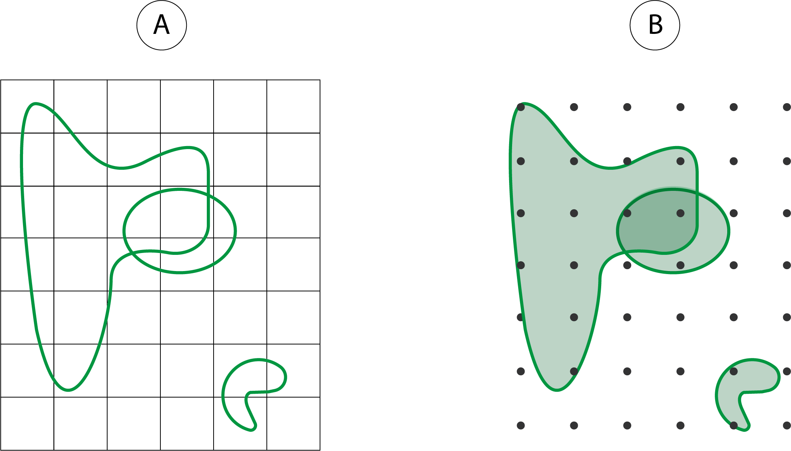{#fig-img_methode_ter fig-align="center" width=70%}

:::{.callout-warning}
## Choix de la résolution de la grille 

La résolution (ou finesse) de la grille construite conditionne directement la précision et la fidélité de la carte de chaleur produite. Une maille large lisse l'information et masque les hétérogénéités locales ; une maille fine préserve davantage les détails mais peut introduire du bruit. 

La résolution a également un impact sur les temps de calcul et l'utilisation de la mémoire vive de votre ordinateur. Le choix de la finesse de la grille implique donc un compromis entre lisibilité, conservation de l'information et puissance de votre machine.

:::


::: panel-tabset

##### A. Construction d'un **carroyage**

Pour cartographier les délimitations du corpus "Beyrouth", nous construisons un carroyage de 100x100m. À cette échelle locale, cette résolution permet de couvrir la totalité de l'emprise spatiale tout en garantissant une finesse d'analyse et un temps de calcul concevable.

La fonction `st_make_grid()` du package sf permet de construire cette grille régulière vectorielle.

```{r grille}
#| fig-align: center


# Récupération de l'emprise géographique de cartes mentales colléctées
emprise <- st_bbox(mentals_maps_beyrouth)

# Création grille vectorielle - objet sfc
grid_beyrouth <- st_make_grid(x = emprise,              # Étendue de la grille
                              cellsize = 100,           # Résolution en mètres
                              square = TRUE,            # Forme 
                              what = "polygons")        # Grille de surface

# Ajout d'un attribut (identifiant) à l'objet sfc (= objet sf)
grid_beyrouth <- st_sf(ID = 1:length(grid_beyrouth ), geom = grid_beyrouth )


```

Pour l'affichage de la grille régulière créée :

```{r grille_map}
#| fig-align: center

# Cartographie
mf_init(st_bbox(mentals_maps_beyrouth))
mf_map(x = beyrouth,
     col = "#cccccc", 
     border = "white", 
       add = TRUE)
mf_map(x = grid_beyrouth, col = NA, lwd= 0.4, add = TRUE)

```

##### B. Construction d'une **grille régulière de points**

Pour le corpus "IMAGEUN" nous suivrons la procédure de cartographie par cumul des surfaces. Pour ce faire nous construisons cette fois-ci une grille régulière de **points**, toujours avec la fonction `st_make_grid()` de `sf`. Ici, ces points sont espacés de 100km pour répondre aux mêmes contraintes que précédemment, couverture de l'emprise, finesse d'analyse et optimisation du temps de calcul.

```{r grille_pts}
#| fig-align: center

# Récupération de l'emprise géographique de cartes mentales collectées
emprise <- st_bbox(mentals_maps_macro)

# Création grille vectorielle de points (objet sfc)
grid_caraibes <- st_make_grid(x = emprise,   # Étendue de la grille
                     cellsize = 100000,      # Résolution en mètres
                     square = TRUE,          # Forme 
                     what = "centers")       # Grille de points

# Ajout d'un attribut (identifiant) à l'objet sfc (= objet sf)
grid_caraibes <- st_sf(ID = 1:length(grid_caraibes), geom = grid_caraibes)


```

Affichage de la grille régulière de points :

```{r grille_pts_map}
#| fig-align: center

# Cartographie
mf_init(st_bbox(mentals_maps_macro))
mf_map(world,
     col = "#85c1d350", 
     border = "#85c1d3",
     lwd = 1,
     add = TRUE)
mf_map(grid_caraibes, cex = 0.3, add = TRUE)

```

:::

# Agrégation des cartes mentales {#sec-aggregation_des_cartes}

## Intersection spatiale

Pour cumuler les cartes mentales sur une grille régulière, nous utilisons la fonction `st_intersects()` qui permet de détecter une intersection spatiale entre deux géométries de différentes couches géographiques (@fig-img_methode_bis), ici entre les grilles régulières de carreaux ou de points, et les cartes mentales. 


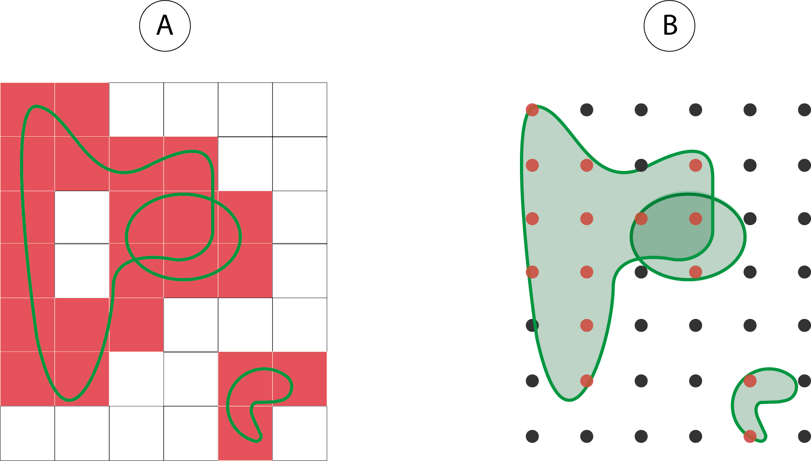{#fig-img_methode_bis fig-align="center" width=75%}

::: panel-tabset

### A. Intersection **carroyage - polylignes**

Dans le cas de Beyrouth, puisque nous souhaitons intersecter uniquement les délimitations, nous transformons dans un premier temps les polygones dessinés en polylignes. Cela permet de ne prendre en compte que les contours des zones délimitées et non leur surface. Nous utilisons ainsi la fonction `st_cast()` pour convertir la géométrie de la couche géographique en `MULTILINESTRING`.

```{r}
#| eval: true
mentals_maps_beyrouth_line <- st_cast(mentals_maps_beyrouth, to = "MULTILINESTRING")
```

Ensuite, nous détectons les intersections des contours dessinés (polylignes) avec le carroyage avec la fonction `st_intersects()`.

```{r}
#| eval: true
# Calcul des intersections grille - polylignes
result_inter_polyligne <- st_intersects(x = grid_beyrouth, 
                                        y = mentals_maps_beyrouth_line, 
                                        sparse = TRUE) 
```

Le résultat des intersections est stocké dans un objet `list`, dont chaque vecteur correspondant à un carreau, contient l'index de ses polylignes intersectées.

```{r}
# Quelles(s) carte(s) mentale(s) intersecte(nt) le 30e carreau de la grille ?
result_inter_polyligne[[30]]
```

Nous utilisons la fonction `lenghts()` sur l'objet `list` généré afin de compter le nombre d'intersections de chaque carreau de la grille avec l'ensemble des délimitations des quartiers dessinés. Le nombre d'intersections détectées est directement stocké dans la variable `count` de la grille.

```{r}
# Ajout du nombre d'intersections détectés dans la variable "count"
grid_beyrouth$count <- lengths(result_inter_polyligne) 
```

Nous obtenons ainsi une représentation graphique simple du nombre d'intersections détectées par carreaux :

```{r}
#| fig-align: center

plot(grid_beyrouth["count"])
```

### B. Intersection **grille de points - polygones**

Pour le corpus "Caraïbe" d'Imageun, nous détectons les intersections des polygones dessinés avec la grille de points régulière en utilisant la fonction `st_intersects()`.

```{r}
#| echo: true
#| eval: true
# Calcul des intersections grille - polygones
result_intersection <- st_intersects(x = grid_caraibes, 
                                     y = mentals_maps_macro, 
                                     sparse = TRUE) 

```

Le résultat des intersections est stocké dans un objet `list` dont chaque vecteur correspondant à un point contient l'index de ses polygones intersectés. Exemple :

```{r}
# Quelles(s) carte(s) mentale(s) intersecte(nt) le 2000e point de la grille ?
result_intersection[[2000]]
```

Nous utilisons ensuite la fonction `lenghts()` sur l'objet `list` généré, pour compter le nombre d'intersections de chaque point avec l'ensemble des régions dessinées. Le nombre d'intersections détectées par point est directement stocké dans la variable `count` de la grille.

```{r}

# Ajout du nombre d'intersections détecté dans la variable "count"
grid_caraibes$count <- lengths(result_intersection) 
```

Nous obtenons ainsi la représentation graphique simple du nombre d'intersections détécté pour chaque point de la grille :

```{r}
#| fig-align: center

plot(grid_caraibes["count"], pch=20, cex=0.5)
```

:::

## Cumul pondéré

Dans le cas d'une pondération de chaque carte mentale, nous utilisons la fonction `st_join()` du package `sf`. Cette fonction permet de réaliser une jointure spatiale[^join] entre deux couches géographiques et de récupérer un poids assigné aux géométries, pour chaque jointure spatiale.

[^join]: La jointure spatiale est une opération qui consiste à associer les attributs d'une couche géographique à une autre couche en fonction de leur relation spatiale (et non d'un identifiant commun comme dans une jointure classique).


```{r}
#| echo: true
#| eval: true
#| message: false

# Jointure spatiale entre grille de points et polygone
sum_weight <- st_join(x = grid_caraibes, 
                      y = mentals_maps_macro) 
```


::: {.callout-note}
## Weighted or not weighted ?
Pour résumer, deux méthodes sont possibles pour agréger des cartes mentales :

- De manière **non-pondérée avec `st_intersects()`** qui permet de comptabilisé le nombre brut d'intersections des cartes avec chaque carreau/point de la grille régulière.

- De manière **pondérée avec `st_join()`** qui permet récupérer (puis d'additionner) une valeur attribuée à chaque carte, pour chaque carreau/point qui les intersecte.
:::

Il suffit ensuite de faire la somme des pondérations récupérées pour chaque carreau avec la fonction `aggregate()`, puis de joindre le résultat à la grille régulière de points avec `merge()`.

```{r}
#| echo: true
#| eval: true
#| message: false
#| fig-align: center

# Groupement par ID - Somme des "weight_scale"
sum_weight <- aggregate(weight_scale ~ ID, data = sum_weight, FUN = sum)

# Ajout sommes pondérée calculée à la grille régulières
grid_caraibes_2 <- merge(grid_caraibes, sum_weight, by = "ID", all.x= TRUE)

# Représentation graphique simple de la somme des intersections pondérées
plot(grid_caraibes_2["weight_scale"], pch=20, cex=0.5)
```

## Normalisation (%)

Afin de faciliter l'interprétation des cartes et leur comparaison, nous pouvons normaliser[^normalisation] la variable `count` en pourcentage. 

[^normalisation]: Normaliser, ici, consiste à transformer un comptage brut (nombre de polygones par carreaux) en une valeur relative en le rapportant à un total de référence (nombre de répondant·es du corpus observé)

### Normalisation de la densité des tracés, en pourcentage (%) :

::: panel-tabset

##### A. Sur Carroyage {.unnembered}

Normalisation de la distribution : calcul de la part de polygones intersectés sur le total de répondant·es du corpus A.

```{r}
#| echo: true
#| eval: true
#| fig-align: center

# Nombre d'intersections / nombre total d'enquétés * 100
grid_beyrouth$ratio <- grid_beyrouth$count / length(unique(mentals_maps_beyrouth_line$Pseudonyme)) * 100

# Remplacement des valeurs "0" par "NA".
grid_beyrouth$ratio[grid_beyrouth$ratio == 0] <- NA

# Affichage graphique du résultat
plot(grid_beyrouth["ratio"], main = "Part des tracés intersectés (%)")
```

##### B. Sur grille régulière de points {.unnembered}

Normalisation de la distribution : part de polylignes intersectées sur le total de répondant·es du corpus B.

```{r}
#| echo: true
#| eval: true
#| fig-align: center

# Nombre d'intersections / nombre total de répondants * 100
grid_caraibes$ratio <- grid_caraibes$count / length(unique(mentals_maps_macro$X0001_met_respID_aut)) * 100

# Remplacement des valeurs "0" par "NA".
grid_caraibes$ratio[grid_caraibes$ratio == 0] <- NA

# Affichage graphique du résultat
plot(grid_caraibes["ratio"], 
     pch=20, 
     cex=0.5, 
     main = "Part des zones intersectées (%)")
```


```{r}
#| echo: false
#| eval: false
#| message: false

st_write(grid_caraibes, dsn = "data/grids.gpkg", layer = "isobande", delete_layer = TRUE) 
st_write(grid_beyrouth_pts, dsn = "data/grids.gpkg", layer = "isoligne", delete_layer  = TRUE) 

```

:::

# Représentation graphique par carte de chaleur {#sec-carte_synthetique}

Nous disposons de toute l'information nécessaire à la construction d'une carte de chaleur représentant la densité des zones ou des tracés dessinés. Cette information étant stockée sous la forme d'un maillage régulier (carreaux ou points), sa représentation graphique est continue et d'aspect "carroyé", comme le montre les figures précédentes.

::: panel-tabset

### A. Rendu graphique sur un carroyage

```{r}
#| eval: true
#| echo: false
#| fig-align: center

mf_init(grid_beyrouth)

# Ajout fond de carte
mf_map(x = beyrouth, 
       border = "lightblue",
       col = "gray90",
       lwd = 0.5,
       add = TRUE)

# cartographie des intersections
mf_map(x = grid_beyrouth, 
       var = "ratio", 
       type = "choro", 
       breaks = mf_get_breaks(grid_beyrouth$ratio, breaks = "equal"), 
       border = NA, 
       pal = "Rocket",
       leg_no_data = "0",
       leg_val_rnd = 0,
       alpha = 0.6, 
       leg_pos = "left", 
       leg_title = "Tracés (%) des\nlimites dessinées",
       add = TRUE)

# superposition des frontières
mf_map(x = beyrouth, 
       border = "lightblue",
       col = NA,
       lwd = 0.2,
       add = TRUE)


# Éléments de mise en page
mf_layout(title = "Découpage de Beyrouth réalisé par les répondant·es",
          credits = "Auteurs : Hugues Pecout, 2025\nSource : Jean Makhlouta,2025")


```

### B. Rendu graphique sur une grille de points

```{r}
#| eval: true
#| echo: false
#| fig-align: center

# initialisation de la fenêtre sur l'emprise choisie (bbox)
mf_init(grid_caraibes)

# Ajout fond de carte
mf_map(world, 
       border = "lightblue",
       col = "gray90",
       lwd = 0.5,
       add = TRUE)

# cartographie des intersections
mf_map(x = grid_caraibes, 
       var = "ratio", 
       type = "choro", 
       breaks = c(1,10,20,20,40,50,60,70,80,90,95), 
       border = NA, 
       pal = "Rocket",
       leg_no_data = "0",
       leg_val_rnd = 0,
       alpha = 0.6, 
       cex = 0.6,
       leg_pos = "left", 
       leg_title = "Recouvrement des\nrégions dessinées (%)\nnommées 'Caraïbes'",
       add = TRUE)

# superposition des frontières
mf_map(world, 
       border = "lightblue",
       col = NA,
       lwd = 0.2,
       add = TRUE)

# Plot the additionnal text
text(x = 7100000,
     y = 9986523,
     cex = .8,
     labels = paste0(length(unique(mentals_maps_macro$X0001_met_respID_aut)), " répondant·es",
                     "\n", nrow(mentals_maps_macro), " tracés"))


# Habillage final
mf_layout(title = "Emprises cumulées des cartes mentales de la régions 'Caraïbes'",
          credits = "Auteur·es : Elina Marveaux, Camille Dabestani, & Hugues Pecout\nSources : ANR - DFG IMAGEUN (2020-2024) - Students Database")

mf_arrow(pos = "topright")

```
:::


Bien que ces cartes soit interprétables en l'état, il est possible d'améliorer leur lisibilité et leur efficacité graphique en construisant des isolignes[^isolignes] à partir de la grille régulière de points.

[^isolignes]: En cartographie, des isolignes sont des lignes d'égale valeur, généralement obtenues par triangulation à partir de points de mesure, représentant la répartition d'une information statistique continue dans l'espace. Exemples : les courbes de niveau (altitude) ou lignes isobares (pression atmosphérique).

## Interpolation spatiale

Dans l'objectif d'accentuer l'efficacité visuelle des cartes synthétiques, nous réalisons une interpolation spatiale[^interpol] des valeurs des centroïdes[^centroides] de notre grille régulière. 


[^interpol]: L'interpolation spatiale est une technique qui permet d'estimer et insérer des valeurs inconnues entre des données connues. L'interpolation permet de réaliser des estimations en utilisant des méthodes mathématiques pour agrémenter des données entre des points de données existantes.

[^centro]: Le centroïde équivaut au centre géométrique ou localisation moyenne d'une entité spatiale


Cela permet, à partir de nos données, d'estimer des points inconnus dont la valeur serait identique, de les localiser par triangulation[^triangul] et de les relier pour construire des isolignes (@fig-isoligne_schema) dans le but de discrétiser notre information spatiale.


[^triangul]: La triangulation est une technique permettant de déterminer la position d'un point en mesurant les angles entre ce point et d'autres points de référence dont la position est connue, et ceci plutôt que de mesurer directement la distance entre les points.


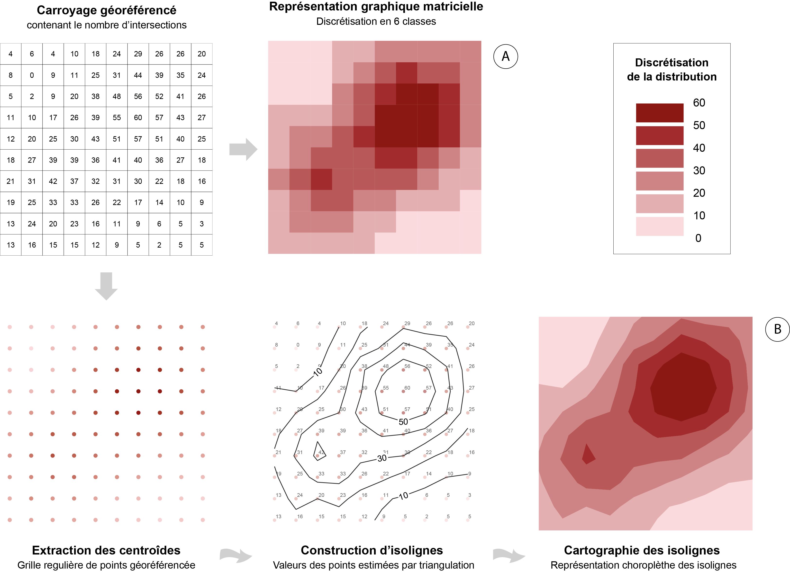{#fig-isoligne_schema fig-align="center"}


Dans le cas où la grille utilisée est un carroyage (ce qui l'est pour le corpus "Beyrouth"), la première étape consiste à la transformer en grille régulière de points. Cela revient à extraire les centroïdes[^centro] des carreaux de la grille régulière, ici en appliquant la fonction `st_centroid()` du package `sf` sur le carroyage vectoriel :
 
```{r}
#| fig-align: center
grid_beyrouth_pts <- st_centroid(grid_beyrouth)
```

```{r}
#| echo: false
#| fig-align: center
#| layout: [[50,50],[50,50]]

mf_map(grid_beyrouth)
title("Carroyage = grid_beyrouth")
mf_map(grid_beyrouth_pts, cex = 0.2)
title("Grille de point = grid_beyrouth_pts")

```

## Discrétisation

À partir du semi de point associé à une variable (ici `ratio`), nous pouvons construire des isolignes et regrouper l'espace par classe de valeur et simplifier la lecture de la carte. 

La construction d'isolignes repose sur le choix d'une méthode de discrétisation. Dans cet exemple, nous optons pour une discrétisation par amplitudes égales[^discr] en 9 classes (8 bornes).

[^discr]: Une discrétisation d'amplitude égale ou discrétisation par équidistance implique que l'étendue de chaque classe est constante.

Pour calculer automatiquement les bornes de classes d'une discrétisation à amplitudes égales, nous pouvons utiliser la fonction `mf_get_break()` du package `mapsf` qui renvoie un vecteur avec les bornes de classes recherchées.

```{r}
#| eval: true
#| fig-align: center

# Discrétisation par amplitudes égales en 9 classes (8 bornes) (intersections des limites de quartier)
breaks_delim <- mf_get_breaks(x = grid_beyrouth_pts$ratio, 
                              breaks = "equal", 
                              nbreaks = 8)

# Discrétisation par amplitudes égales en 9 classes (8 bornes) (intersections des surfaces de région)
breaks_area <- mf_get_breaks(x = grid_caraibes$ratio, 
                             breaks = "equal", 
                             nbreaks = 8)

# Bornes de classes calculées
print(breaks_delim) 

```

## Création d'isolignes

Le package `mapiso` permet de créer des isolignes en fonction d'une discrétisation prédéfinie. Nous les construisons ici avec la fonction `mapiso()` à partir du vecteur récupéré et de la grille régulière de points valués (variable `ratio`).

::: panel-tabset

### A. Création d'isolignes (limites de quartiers)

```{r}
#| eval: true
#| fig-align: center

iso_limites <- mapiso(x = grid_beyrouth_pts,
               var = "ratio", 
               breaks = breaks_delim)

```

Voici l'affichage des isolignes (objet `sf` de polygones) générées :

```{r}
#| eval: true
#| fig-align: center

mf_map(iso_limites)
```

### B. Création d'isolignes (emprises de régions)

```{r}
#| eval: true

iso_surface <- mapiso(x = grid_caraibes,
               var = "ratio", 
               breaks = breaks_area)
```

Voici l'affichage des isolignes (objet `sf` de polygones) générées :

```{r}
#| eval: true
#| fig-align: center

mf_map(iso_surface)

```

:::

Il est possible à présent cartographier les isolignes calculées en utilisant un dégradé de couleur, qui traduit la densité de recouvrement de l'espace par le corpus de cartes mentales étudié.

## Résultats cartographiques

:::: panel-tabset

### A. Délimitation de quartiers à Beyrouth

```{r}
#| eval: true
#| echo: false
#| fig-align: center

# Paramètrage de l'emprise de la carte
mf_init(iso_limites)

# Ajout fond de carte 'beyrouth'
mf_map(x = beyrouth, 
       border = "lightblue",
       col = "gray80",
       lwd = 0.5,
       add = TRUE)

# Carte de chaleur
mf_map(x = iso_limites,
       var = "isomin", 
       type = "choro", 
       breaks = breaks_delim, 
       border = NA, 
       pal = "Rocket",
       alpha = 0.6, 
       leg_pos = "left", 
       leg_title = "Tracés (%) des\nlimites dessinées",
       leg_val_rnd = 1,
       add = TRUE)

# Superposition fond de carte 'beyrouth'
mf_map(x = beyrouth, 
       border = "white",
       col = NA,
       lwd = 0.2,
       add = TRUE)

# Éléments de mise en page
mf_layout(title = "Découpage de Beyrouth réalisé par les répondant·es",
          credits = "Auteurs : Hugues Pecout, 2025\nSource : Jean Makhlouta, 2025")
```

```{r}
#| eval: false
#| echo: true
#| fig-align: center
#| code-fold: true
#| code-summary: Cacher/Montrer le code


# Paramètrage de l'emprise de la carte
mf_init(iso_surface)

# Ajout fond de carte 'beyrouth'
mf_map(x = beyrouth, 
       border = "lightblue",
       col = "gray80",
       lwd = 0.5,
       add = TRUE)

# Carte de chaleur
mf_map(x = iso_surface, 
       var = "isomin", 
       type = "choro", 
       breaks = breaks_delim, 
       border = NA, 
       pal = "Rocket",
       alpha = 0.6, 
       leg_pos = "left", 
       leg_title = "Tracés (%) des\nlimites dessinées",
       leg_val_rnd = 1,
       add = TRUE)

# Superposition fond de carte 'beyrouth'
mf_map(x = beyrouth, 
       border = "white",
       col = NA,
       lwd = 0.2,
       add = TRUE)

# Éléments de mise en page
mf_layout(title = "Découpage de Beyrouth réalisé par les répondant·es",
          credits = "Auteurs : Hugues Pecout, 2025\nSource : Jean Makhlouta, 2025")

```

:::{.callout-tip}
## Commentaire de carte

À partir de la cartographie synthétique des délimitations des quartiers, des seuils nets apparaissent autour de certains quartiers ou ensembles de quartiers. Ils représentent des lieux ou des limites polarisantes dans les pratiques et les représentations des répondant·es. Entre quartiers de résidence et quartiers pratiqués quotidiennement, les mobilités et les stratégies d'appropriation et de négociation de l'espace urbain opérées par ce biais participent à produire leurs représentations des quartiers [@makhlouta_resister_2024]. Ces espaces peuvent être associés à des représentations positives, et du fait des pesanteurs et de répressions sociales et pénales auxquelles font face les minorités sexuelles et de genre, deviennent des lieux de mise en place de stratégies d'évitement et de contournement de la surveillance des autorités publiques (présence de forces de l'ordre dans les quartiers du centre-ville, parfois sous la forme de check-point à Koraytem à l'est, ou dans le quartier de l'ambassade de France à l'ouest) ou dans des quartiers sous l'emprise de groupes politico-religieux (banlieue sud et quartier d'Achrafieh à l'est) [@makhlouta_mobilite_2024].

:::

### B. Délimitation de la macro-région 'Caraïbes'

```{r}
#| eval: true
#| echo: false
#| fig-align: center

# initialisation de la fenêtre sur l'emprise choisie
mf_init(iso_surface)

# Ajout fond de carte
mf_map(x = world, 
       border = "white",
       col = "gray80",
       lwd = 0.5,
       add = TRUE)

# cartographie des intersections
mf_map(x = iso_surface, 
       var = "isomin", 
       type = "choro", 
       breaks = breaks_area, 
       border = NA, 
       pal = "Rocket",
       alpha = 0.6, 
       leg_pos = "left", 
       leg_title = "Recouvrement des\nrégions dessinées (%)\nnommées 'Caraïbes'",
       add = TRUE)

# superposition des frontières
mf_map(x = world, 
       border = "white",
       col = NA,
       lwd = 0.2,
       add = TRUE)

# Habillage final
mf_layout(title = "Emprises cumulées des cartes mentales de la régions 'Caraïbes'",
          credits = "Auteur·es : Elina Marveaux, Camille Dabestani, & Hugues Pecout\nSources : ANR - DFG IMAGEUN (2020-2024) - Students Database")


```


```{r}
#| eval: false
#| echo: true
#| fig-align: center
#| code-fold: true
#| code-summary: Cacher/Montrer le code

# initialisation de la fenêtre sur l'emprise choisie
mf_init(iso_surface)

# Ajout fond de carte
mf_map(x = world, 
       border = "white",
       col = "gray80",
       lwd = 0.5,
       add = TRUE)

# cartographie des intersections
mf_map(x = iso_surface, 
       var = "isomin", 
       type = "choro", 
       breaks = breaks_area, 
       border = NA, 
       pal = "Rocket",
       alpha = 0.6, 
       leg_pos = "left", 
       leg_title = "Recouvrement des\nrégions dessinées (%)\nnommées 'Caraïbes'",
       add = TRUE)

# superposition des frontières
mf_map(x = world, 
       border = "white",
       col = NA,
       lwd = 0.2,
       add = TRUE)


# Habillage final
mf_layout(title = "Emprises cumulées des cartes mentales de la régions 'Caraïbes'",
          credits = "Auteur·es : Elina Marveaux, Camille Dabestani, & Hugues Pecout\nSources : ANR - DFG IMAGEUN (2020-2024) - Students Database")


```

:::{.callout-tip}
## Commentaire de carte

Sur la carte ci-dessus, on retrouve la synthèse cumulée des cartes mentales où les étudiant·es ont nommé leur tracé « Caraïbe(s) ». On voit se dessiner les représentations spatiales associées à un terme : des espaces faisant partie quasi systématiquement des tracés (en violet foncé, ici l'est de l'arc antillais), des « marches » où on voit apparaître des limites collectives dans les représentations des enquêté·es (ici Haïti ou les espaces continentaux) ainsi que les spatialités les moins fréquentes, mais bien présentes des cartes mentales de l'échantillon (ici emprises sur l'Amérique centrale ou le nord de l'Amérique du Sud).

Cette même démarche permet d'appréhender et de comparer des groupes au sein d'un même corpus en fonction d'autres critères sémantiques (« Antilles », « Amérique … »), de critères socio-démographiques (niveau d'inscription, discipline étudiée, âge ou encore genre) ou de critères spatiaux (nombre d'espaces tracés ou continentalité et insularité, par exemple).
:::

::::

# Comparaison des corpus

Le cumul des tracés dans une même grille régulière géoréférencée permet la représentation graphique synthétique d'un ensemble de cartes mentales. Il s'agit donc d'une méthode d'aide à l'interprétation des données collectées, à une échelle agrégée.

La transposition de plusieurs sous-corpus de cartes dans une même grille de référence peut aussi être utilisée pour comparer deux cartes synthétiques. Dans le cadre de l'ANR-DFG Imageun, les étudiant·es de cinq pays ont été enquêté·es, et du fait de leurs positionnements, les espaces européens (UE, Europe, etc.) sont apparus dans l'ensemble des corpus nationaux de cartes mentales. Cependant, les représentations d'un même objet vont grandement varier entre et au sein des corpus. Si le reste du questionnaire (et les entretiens dans le cadre caribéen [@dabestani_repenser_2025]) permet d'approfondir les différents enjeux politiques et symboliques derrière cet objet, les variations dans les représentations spatiales peuvent être abordées par l'analyse comparative des cartes mentales portant sur un même objet dans différents corpus.

Ainsi, dans l'exemple suivant nous construisons une carte dite "différentielle" qui cartographie les écarts de recouvrement de l'espace entre deux groupes d'enquêtés : les étudiant·es des universités de France hexagonale et les étudiant·es des université allemandes. Il s'agit ici de comparer les différences d'emprises de l'Union Européenne dessinées par les deux groupes d'étudiant·es.

## Importation des données 

Nous commençons par importer les données supplémentaires nécessaires, à savoir les réponses au questionnaire associées à la question de carte mentales (cf. @sec-corpus_B_regionales). Cela permet de sélectionner les répondant·es en fonction de leur pays d'étude.

```{r}
# Import des données d'enquête
data <- read.csv("data/survey.csv")
```

Nous joignons ensuite le tableau de données à la couche géographique des cartes mentales collectées en utilisant l'identifiant unique des répondant·es.

```{r}
data_full <- merge(mentals_maps_macro_reg, data, by= "X0001_met_respID_aut")
```

Nous sélectionnons les régions dessinées nommées "UE" ou "Union Européenne".

```{r}
data_UE <-  subset(data_full,E1903_map_rgname_lab_fr %in% c("UE", "Union Européenne"))
```

Enfin, à partir de la sélection, nous créons deux sous-corpus de cartes mentales de l'UE, l'un des cartes réalisées dans les universités de France hexagonale, l'autre des cartes réalisées dans les universités allemandes.

```{r}
# Corpus de cartes mentales des étudiants français
data_french <- subset(data_UE, A0405_cad_univer_lab_country %in% c("France Metropolitan"))

# Corpus de cartes mentales des étudiants allemands
data_german <- subset(data_UE, A0405_cad_univer_lab_country %in% c("Germany"))
```

## Une grille unique...

Nous construisons ensuite une seule grille de points (espacés de 100km) sur l'espace européen, avec laquelle nous intersectons respectivement les deux corpus de cartes mentales sélectionnés.

```{r}
# Récupération de l'emprise géographique de cartes mentales des deux corpus
emprise <- st_bbox(data_UE)

# Création grille vectorielle de points (objet sfc)
grid_UE <- st_make_grid(x = emprise, 
                     cellsize = 100000,      # Résolution en mètres
                     square = TRUE,          # Forme 
                     what = "centers")       # Grille de points

# Ajout d'un attribut (identifiant des points) 
grid_UE <- st_sf(ID = 1:length(grid_UE), geom = grid_UE)
```

## ... pour deux cartes

Nous intersectons respectivement chaque sous-corpus avec la même grille et normalisons ensuite les données en rapportant le nombre d'intersections détectées au nombre total d'enquêté·es.

:::: panel-tabset

### Pour les étudiant·es des universités de France hexagonale

```{r}
#| fig-align: center

# Intersections grille - polygones
result_fr <- st_intersects(x = grid_UE, 
                           y = data_french, 
                           sparse = TRUE) 

# Récupération du nombre d'intersections
grid_UE$count_fr <- lengths(result_fr) 

# Normalisation
grid_UE$pct_fr <- grid_UE$count_fr / length(unique(data_french$X0001_met_respID_aut)) * 100

```

Nous obtenons la carte synthétique de l'emprise imaginée de l'UE par les étudiant·es de l'hexagone :

```{r}
#| fig-align: center
#| code-fold: true
#| code-summary: Cacher/Montrer le code

# initialisation de la fenêtre sur l'emprise choisie
mf_init(grid_UE)

# Ajout fond de carte
mf_map(x = world, 
       border = "lightblue",
       col = "gray90",
       lwd = 0.5,
       add = TRUE)

# cartographie des intersections
mf_map(x = grid_UE, 
       var = "pct_fr", 
       type = "choro", 
       breaks = c(0,10,20,30,40,50,60,70,80,90,100), 
       border = NA, 
       pal = "Rocket",
       alpha = 0.6, 
       leg_pos = "left", 
       leg_title = "Recouvrement des\nrégions dessinées (%)\nnommées 'UE'",
       leg_val_rnd = 1,
       add = TRUE)

# superposition des frontières
mf_map(x = world, 
       border = "lightblue",
       col = NA,
       lwd = 0.2,
       add = TRUE)

# Habillage final
mf_layout(title = "Emprises cumulées des cartes de la régions 'UE' - Etudiant·es en France hexagonale",
          credits = "Auteur·es : Elina Marveaux, Camille Dabestani, & Hugues Pecout\nSources : ANR - DFG IMAGEUN (2020-2024) - Students Database")

```

### Pour les étudiant·es des universités allemand·es

```{r}
#| fig-align: center


# Calcul des intersections grille - polygones
result_de <- st_intersects(x = grid_UE, 
                           y = data_german, 
                           sparse = TRUE) 

# Récupération du nombre d'intersections
grid_UE$count_de <- lengths(result_de) 

# Normalisation
grid_UE$pct_de <- grid_UE$count_de / length(unique(data_german$X0001_met_respID_aut)) * 100

```


Nous obtenons cette carte synthétique de l'emprise imaginée de l'UE par les étudiant·es des universités allemand·es :

```{r}
#| fig-align: center
#| code-fold: true
#| code-summary: Cacher/Montrer le code

# initialisation de la fenêtre sur l'emprise choisie
mf_init(grid_UE)

# Ajout fond de carte
mf_map(x = world, 
       border = "lightblue",
       col = "gray90",
       lwd = 0.5,
       add = TRUE)

# cartographie des intersections
mf_map(x = grid_UE, 
       var = "pct_de", 
       type = "choro", 
       breaks = c(0,10,20,30,40,50,60,70,80,90,100), 
       border = NA, 
       pal = "Rocket",
       alpha = 0.6, 
       leg_pos = "left", 
       leg_title = "Recouvrement des\nrégions dessinées (%)\nnommées 'UE'",
       leg_val_rnd = 1,
       add = TRUE)

# superposition des frontières
mf_map(x = world, 
       border = "lightblue",
       col = NA,
       lwd = 0.2,
       add = TRUE)

# Habillage final
mf_layout(title = "Emprises cumulées des cartes de la régions 'UE' - Etudiant·es en Allemagne",
          credits = "Auteur·es : Elina Marveaux, Camille Dabestani, & Hugues Pecout\nSources : ANR - DFG IMAGEUN (2020-2024) - Students Database")

```

::::

:::{.callout-tip}
## Commentaire de cartes

Dans l'exemple présenté ici, l'analyse des deux corpus de cartes mentales (français et allemand) représentant les espaces nommés « UE » permet de donner à voir les variations fines des représentations entre les deux groupes. On observe ainsi des représentations de l'UE davantage projetées vers l'ouest pour les étudiant·es de l'Hexagone et vers l'est chez les étudiant·es en Allemagne, tandis que l'espace méditerranéen apparaît comme une discontinuité forte chez le premier groupe, et comme un gradient chez le second.

:::

## Cartographie différentielle

Pour aller plus loin, la comparaison de ces deux cartes synthétiques peut être formalisée par la construction d'une carte différentielle qui met en exergue les écarts de représentation d'un même objet spatial entre deux groupes d'individus.

Pour reprendre l'exemple des représentations de l'UE chez les étudiant·es de l'hexagone et en Allemagne, il est possible de faire apparaître les écarts de pourcentage de recouvrement entre les deux corpus sur une même carte.

Pour cela, nous soustrayons les taux d'intersection d'un corpus aux taux d'intersection du second corpus. Le résultat de cette soustraction est stockée dans la colonne `diff_fr_de`.

```{r}
# Différence pourcentage de recouvrement des deux corpus de cartes
# étudiant·es français·es - étudiant·es allemand·es
grid_UE$diff_fr_de <- grid_UE$pct_fr - grid_UE$pct_de

```

Pour la construction d'isolignes, nous devons déterminer des bornes de classes (valeur des isolignes).

```{r}
# Construction d'un vecteur de bornes de classes
discr <- c(min(grid_UE$diff_fr_de), -20,-10,-5,-2,0,0,2,5,10,20,30, 
           max(grid_UE$diff_fr_de))
```

Nous construisons également une palette de couleurs divergentes (vecteur de couleur) avec la fonction `mf_get_pal()` adaptée aux données réparties autour de 0.

```{r}
# Construction d'un vecteur de couleur divergentes
cols <- mf_get_pal(n = c(5, 6), pal = c("greens", "Reds 2"), neutral = NA)
```

À partir du vecteur de bornes de classes et de la grille de points, nous calculons les isolignes.

```{r}
iso_surface <- mapiso(x = grid_UE,
               var = "diff_fr_de", 
               breaks = discr)

```

Enfin nous cartographions le résultat.

```{r testfig}
#| fig-align: center
#| code-fold: true

# Paramétrage de l'emprise
mf_init(iso_surface)

# Ajout fond de carte
mf_map(x = world, 
       border = "lightblue",
       col = "gray90",
       lwd = 0.5,
       add = TRUE)

# cartographie des intersections
mf_map(x = iso_surface, 
       var = "isomin", 
       type = "choro", 
       breaks = discr, 
       border = NA, 
       pal = cols,
       alpha = 0.6, 
       leg_pos = "left", 
       leg_title = "Différence en\npoints (%)",
       leg_val_rnd = 1,
       add = TRUE)

# superposition des frontières
mf_map(x = world, 
       border = "white",
       col = NA,
       lwd = 0.3,
       add = TRUE)

# Ajout d'un bloc de légende
mf_legend(type = "typo", 
          val = c("Les étudiant·es de l'hexagone", 
                  "Les étudiant·es en Allemagne"), 
          pal = c("#7F000D99","#267C3599"),
          pos = "topleft", title = "D'avantage recouvert par :")

# Titre
mf_title("Différence des emprises dessinées de l'UE, entre étudiant·es FR et DE")

# Sources
mf_credits("Auteur·es : Camille Dabestani, Elina Marveaux & Hugues Pecout\nSources : ANR - DFG IMAGEUN (2020-2024) - Students Database")
```

:::{.callout-tip}
## Commentaire de carte

Par différence de points de pourcentage, on voit apparaître en vert les espaces davantage représentés chez les étudiant·es en Allemagne (est de l'Europe, bassin méditerranéen et Turquie) et en rouge ceux figurant plus chez les étudiant·es en France (frange la plus à l'est et frontière russe, façade atlantique).

Nous percevons également que plusieurs territoires, non-membres de l'UE, comme le Royaume-uni, l'Ukraine, la Serbie, l'Albanie, etc. semblent plus souvent inclus dans l'UE par les étudiant·es du corpus français que par les étudiant·es du corpus allemand.

:::

# Conclusion {.unnumbered}

En réunissant traitement spatial, quantification statistique et visualisation cartographique, la méthode présentée dans cet article ouvre des perspectives réplicables en SHS pour étudier des corpus de cartes mentales. Dans une démarche complémentaire à des recherches qualitatives et mixtes, cette approche formalise une chaîne de traitement standardisée et documentée qui peut être appliquée sur des jeux de données variés, issus d'enquêtes micro-locales ou macro-régionales et sur des corpus de tailles variées. Grâce à l'usage de grilles régulières, d'agrégations spatiales et de représentations telles que les cartes de chaleur ou isolignes, il devient possible de décrire, mesurer et comparer objectivement des tendances collectives à partir de données subjectives. La possibilité de générer des représentations cartographiques et des indicateurs quantitatifs reproductibles enrichit et s'articule à l'interprétation qualitative des cartes mentales, en offrant un cadre permettant de relier les expériences individuelles aux tendances collectives et de réaliser des comparaisons fiables entre terrains et groupes.

\

# Bibliographie {.unnumbered}

:::{#refs}

:::


# Annexes {.unnumbered}


##### Informations de session {.unnumbered}


```{r session_info, echo=FALSE}
sessionInfo()

```

